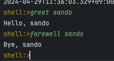

= Spring Shell

https://docs.spring.io/spring-shell/reference/getting-started.html

 git checkout -f feature/spring_shell

라이브러리 추가

properties 에 spring-shell.version 값 추가

[source, xml]
----
<properties>
    <spring-shell.version>3.2.4</spring-shell.version>
</properties>
----
dependency 추가

[source, xml]
----
<dependency>
    <groupId>org.springframework.shell</groupId>
    <artifactId>spring-shell-starter</artifactId>
</dependency>
----
dependencyManagement 추가

[source, xml]
----
<dependencyManagement>
    <dependencies>
        <dependency>
            <groupId>org.springframework.shell</groupId>
            <artifactId>spring-shell-dependencies</artifactId>
            <version>${spring-shell.version}</version>
            <type>pom</type>
            <scope>import</scope>
        </dependency>
    </dependencies>
</dependencyManagement>
----

커맨드를 받아서 처리할 수 있는 클래스 생성

@ShellComponent

@ShellMethod

[source, java]
----
@ShellComponent
public class MyCommands {

    @ShellMethod
    public String greet(String name) {
        return "Hello, " + name;
    }

    @ShellMethod
    public String farewell(String name) {
        return "Bye, " + name;
    }
}
----

실행 화면

